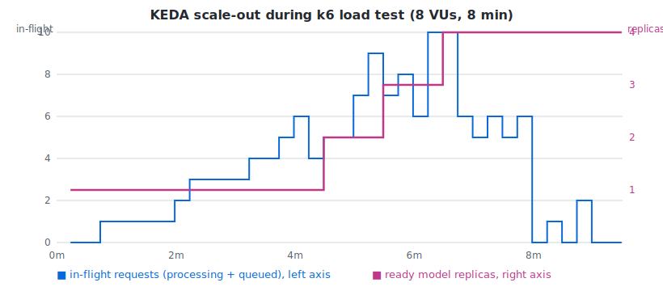

# LLM Inference Platform on EKS

Self-hosted, open-weight LLM serving on AWS — built as a platform-engineering
exercise: infrastructure as code, observability, event-driven autoscaling and
load-tested evidence that it all works.

**Stack:** Terraform · EKS (spot) · llama.cpp (Qwen2.5-0.5B-Instruct) ·
FastAPI gateway · Prometheus + Grafana · KEDA · k6 · GitHub Actions (OIDC)

## Architecture

```
                        ┌──────────────────────── EKS (spot nodes) ───────────────────────┐
                        │                                                                  │
  k6 load test ──► NLB ─┼─► llm-gateway (FastAPI)          llm-model (llama.cpp server)   │
                        │     · bearer-token auth     ──►    · OpenAI-compatible API      │
                        │     · rate limiting                · Qwen2.5-0.5B GGUF, CPU     │
                        │     · /metrics                     · /metrics (tokens/s, slots) │
                        │            │                              ▲                     │
                        │            ▼                              │ scales replicas     │
                        │      Prometheus ◄── ServiceMonitors ── KEDA (in-flight-requests │
                        │            │                             trigger via PromQL)    │
                        │            ▼                                                    │
                        │        Grafana (latency p95, tokens/sec, replica count)         │
                        └──────────────────────────────────────────────────────────────────┘

  GitHub Actions ── OIDC (no stored keys) ──► ECR ──► Helm deploy
```

## Design decisions (the interesting bits)

- **CPU inference on spot instances.** A 0.5B-parameter model quantized to
  Q4_K_M serves genuinely useful completions on 2 vCPUs. The point of the
  project is the *platform* around the model — the same chart serves a 70B
  model on GPU nodes by changing `values.yaml`.
- **KEDA over plain HPA, scaling on in-flight requests.** CPU is useless as
  a signal here — LLM inference saturates CPU at one request, so CPU-based
  HPA can't distinguish "busy" from "overloaded". The first version scaled
  on *request rate*, which failed in an instructive way: a saturated model
  caps throughput, so the observed rate never rises above the threshold no
  matter how bad latency gets. The trigger now uses llama.cpp's own
  saturation gauges (`llamacpp:requests_processing + requests_deferred`) —
  "requests are queueing" is the signal, one threshold, no magic rate number.
- **Public subnets, no NAT gateway.** Saves ~$32/month; a deliberate lab
  trade-off documented here so it reads as a choice, not an oversight.
- **Cost guardrails.** Spot capacity, ECR lifecycle policy, AWS Budget with
  email alerts at 50/80/100%, and `make down` destroys everything. A full
  work session costs well under $1.

## Runbook

```bash
cd terraform && cp example.tfvars terraform.tfvars   # set your alert email
make up            # ~12 min: VPC, EKS, ECR, budget alarm
make deploy-infra  # kube-prometheus-stack + KEDA
make build         # gateway image → ECR
make deploy        # helm install; prints the NLB endpoint
make loadtest GATEWAY_URL=http://<nlb-dns>:8080
make grafana       # port-forward dashboards
make down          # destroy everything — end of session!
```

Smoke test:

```bash
curl -s http://<nlb-dns>:8080/v1/chat/completions \
  -H "Authorization: Bearer dev-key" -H "Content-Type: application/json" \
  -d '{"messages":[{"role":"user","content":"Say hello in 5 words"}],"max_tokens":32}'
```

## Load-test results

k6 ramps 0→8 virtual users over 4 minutes, holds, then ramps down
(`loadtest/chat.js`, ~64-token completions on 2-vCPU spot nodes).



*(chart generated from Prometheus range queries over the run)*

| | 1 replica, rate trigger | 1→4 replicas, in-flight trigger |
|---|---|---|
| requests completed | 135 | **195 (+44%)** |
| failed | 0% | **0%** |
| p95 latency | 29.7s | **24.2s** |
| KEDA scale-out | none (rate never crossed threshold) | **1→2→3→4 replicas in ~3 min** |

The bottleneck is exactly what you'd expect for CPU inference: token
generation throughput. A single replica with 2 parallel slots holds p95
just under 30s at 8 VUs; scaling to 4 replicas cuts queueing and adds 44%
throughput. Scale-in follows automatically after the cooldown window.

### Field note: the mysterious 15-second 502s

The first load test "failed" with 80% errors — every failure a uniform
~15.5s, while the gateway's own Prometheus counters said it returned 200
for nearly all of them. The k6 box and the cluster disagreed about reality.
An NLB is layer-4 and can't fabricate a 502, so something *HTTP-aware*
between the client and AWS was killing slow responses: the ISP transparently
proxies port-80 traffic and times out at ~15s. Moving the NLB listener to
port 8080 fixed it instantly. Moral: when client and server metrics
disagree, believe both — and go find the middlebox lying between them.

## What I'd do differently in production

- Private subnets + NAT (or VPC endpoints), IRSA-scoped pods
- Model weights baked into an image or pulled from S3 (HuggingFace is a
  single point of failure at pod start)
- vLLM on GPU nodes with continuous batching for real throughput
- Streaming (SSE) support through the gateway
- Per-key quotas in Redis instead of in-memory (survives replica restarts)
